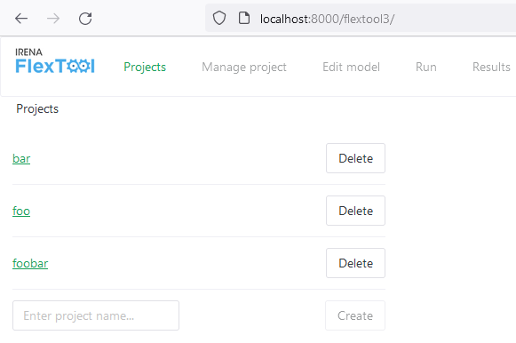
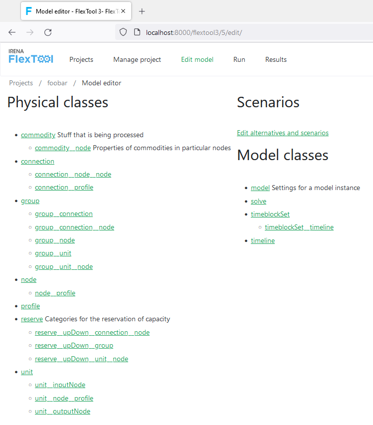

[Install](https://github.com/irena-flextool/flextool/tree/master#irena-flextool) | [Tutorial](https://irena-flextool.github.io/flextool) | [Reference](https://irena-flextool.github.io/flextool/reference) | [Data structure](https://irena-flextool.github.io/flextool/spine_database) | [Spine Toolbox interface](https://irena-flextool.github.io/flextool/spine_toolbox) | [Browser-interface](https://irena-flextool.github.io/flextool/browser_interface)

## Browser interface in brief

The browser interface connects to an instance of [FlexTool web interface](https://github.com/irena-flextool/flextool-web-interface). 
It can show and edit the same data as the Spine Toolbox. The workflow is not directly visible, 
but it is executed in the background when models are run.

The main page shows the projects available for the user.

The front page for the data editor shows all the data classes that can be shown and edited. 
Different data classes can be opened to separate browser tabs for convenience.

Parameter data can be shown and edited once the user chooses an object and an alternative.

On the 'Run' page, the user can select and execute scenarios.

Finally, the results page shows the model outputs taken from the result database. 
The results database can also be opened with Spine Toolbox for more control 
over the shown data as well as export capabilities.

