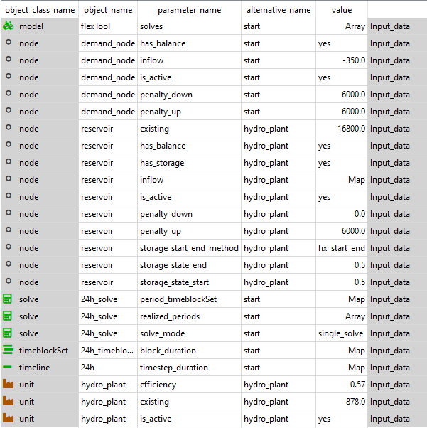
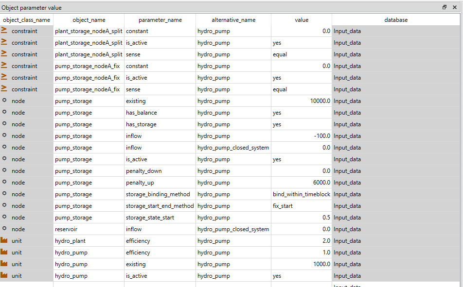
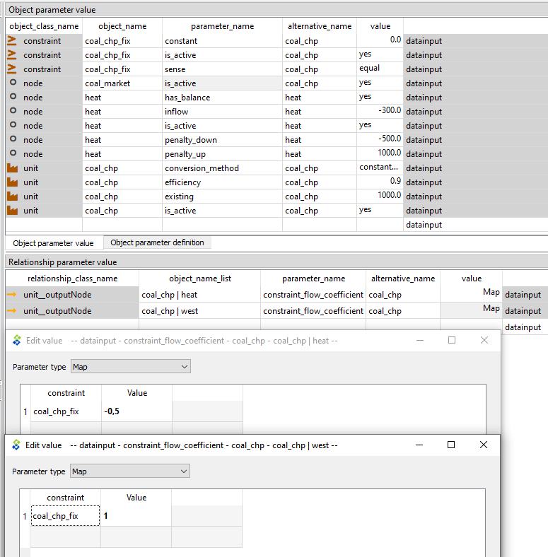
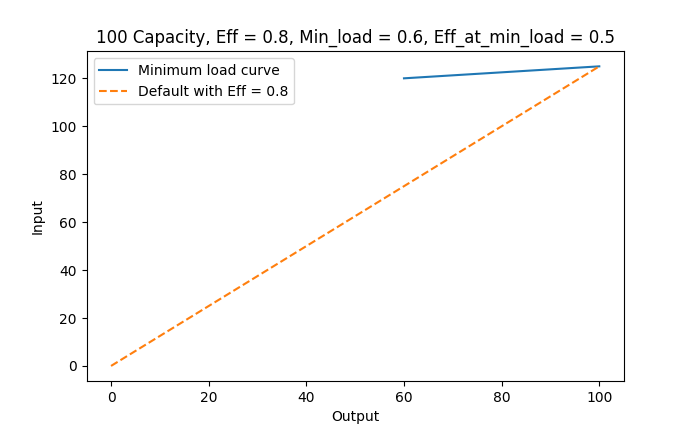
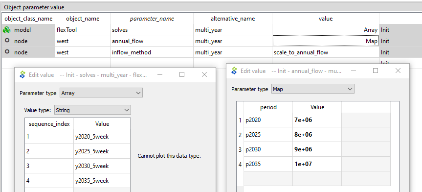
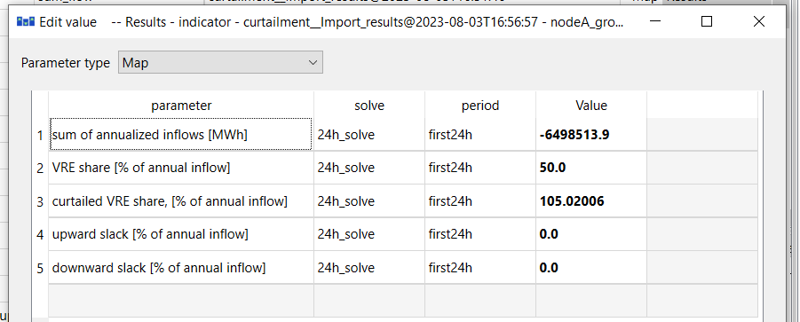

# How to

How to section contains examples on how to build common energy system components. The examples assume a working understanding of FlexTool.
Each example will include an example database file that are located in the 'how to examples databases' folder or they are included in the init.sqlite as a scenario. You can change the filepath to database used as the input data by clicking the input_data tool.

## How to create a PV / Wind / hydro run-of-river-plant
**(init.sqlite scenario: wind)**
***init - west - wind ***

These three plants don't use a commodity that's usage can be controlled, but instead are dependant on timeseries profile.
To create these plants one needs a demand/storage node, an unit and a profile.

The unit only needs `is_active` and `existing` parameters, where the `existing` is the max capacity of the plant. The `conversion_method` should be at its default value constant_efficiency and the `efficiency` should be set to 1 as it should be included in the profile as it tends to change with time.
The profile only has one parameter that is a timeseries map that tells what fraction of the capacity the plant produces at each timestep ie. the power-curve. 

The realtionships unit_outputnode (plant|demand node) and unit_node_profile (plant|demand node|profile) should be both created.

The unit_node_profile relationship needs a parameter `profile_method` that has three options `upper_limit`, `lower_limit` and `exact`. It states how the profile is considered. In most cases the `upper_limit` options should be used as it allows the option to curtail the production if there is more supply than demand. Otherwise the nodes or connections might have to produce downward_penalty.


## How to add a storage unit (battery) 

**(init.sqlite, scenario: wind_battery)**
***init - west - wind - battery***

In the ***Init*** SQLite database, there is a `scenario` *wind_battery* - the *wind_plant* alone is not able to meet the load in all conditions, but the *battery* will help it to improve the situation.

In FlexTool, only `nodes` can have storage. `Nodes` can therefore be demand nodes, storage nodes or both. To make a storage node one the required parameters are:

- `is_active`: yes
- `has_balance`: yes
- `has_storage`: yes
- `existing`: The maximum storage size of battery as the potential energy [MWh]
- `penalty_up`: a large number to prefer not creating energy from nowhere
- `penalty_down`: a large number to prefer not creating energy from nowhere

Additional parameters:
- `self_discharge_loss` The fraction of energy loss in each hour.

Storage states can be tied to a value. For this three methods are introduced:
- `storage_start_end_method`: Fixes start and/or end state of the solve to a value.
    -  `storage_state_start` and `storage_state_end` set these values.
- `storage_bind_method`: Forces the start and end values to be the same for some time interval (timeblock,period,solve)
- `storage_solve_horizon_method`: Sets the end value of a solve or sets a price to it for the objective function
    - `storage_state_reference_value` and `storage_state_reference_price` set these values
  
Having multiple storage methods can create infeasible problems. This is why some of the combinations shouldn't (and cannot) be used at the same time. If multiple methods are used, some of them might be ignored by the method hierarcy. More information can be found from [Model Parameters: Using nodes as storages](https://irena-flextool.github.io/flextool/reference). 

Battery also needs charging and discharging capabilities. These could be presented either with a `connection` or by having a charging `unit` and a discharging `unit`. In here, we are using a `connection` called *batter_inverter*, since its easier to prevent simultaneous charging and discharging that way (although, in a linear model, this cannot be fully prevented since that requires an integer variable). Please note that the `efficiency` parameter of the `connection` applies to both directions, so the round-trip `efficiency` will be `efficiency` squared.

The `transfer_method` can be used by all types of connections, but in this case it is best to choose *regular*, which tries to avoid simultaneous charging and discharing, but can still do it when the model needs to dissipate energy. *exact* method would prevent that, but it would require integer variables and make the storage computationally much more expensive. Model leakage will be reported in the results (forthcoming).

The required paremeters of the connection are:
- `is_active`: yes
- `existing`: The capacity of energy transsmission [MW]
- `transfer_method`: (see previous)

Additional parameters:
-`efficiency` by default 1

Finally connection_node_node relationship is needed between inverter, the battery and the demand node (west). 


## How to create a hydro reservoir
**hydro_reservoir.sq**

~~~
Note! This example concerns a single reservoir hydro power plant. 
If the river system has multiple plants in a series and their operations are tied, 
then multiple nodes and units are needed to represent the system.
~~~

The objective is to create a hydro power plant with a reservoir and connect it to a demand node.

Hydro reservoir power plant requires three components:

- Reservoir `node`
- Hydro `unit`
- Output `node`

It can be useful to create a new alternative for these components to be able to include and exclude them from the scenarios.

The reservoir is made with a node as only nodes can have storage in FlexTool. The incoming water can be represented by the inflow parameter. It can be a constant or a time variant. The unit of the inflow should be the power that can be created from the quantity of the incoming water at maximum efficiency [MW]. In the same way, the existing storage capacity should be the maximum amount of stored energy that the reservoir can hold [MWh].
In this implementation of reservoir hydro power, there is an option to spill water (energy) from the storage so that it does not run through the plant. The simplest way of allowing spilling is setting the downward penalty of the node to 0. This way the energy can disappear from the storage without a cost. The quantity of spilled energy can be seen from the results as the 'downward slack' of the node.

The required parameters of the reservoir node are (node_c and node_t sheets if using Excel input data):

- `is_active`: yes
- `has_balance`: yes
- `has_storage`: yes
- `inflow`: Mapping of the incoming water as the potential power [MW]
- `existing`: The maximum size of the reservoir as the potential energy [MWh]
- `penalty_up`: a large number to prefer not creating energy from nowhere
- `penalty_down`: 0 or a large number (spilling or not)
- a `storage_method` to set the behaviour on how the storage levels should be managed - for short duration storages *bind_within_timeblock* may be best and for seasonal storages it could be best to use *bind_within_solve*. If historical storage level time series are available, it can be beneficial to use *fix_start* in the `storage_start_end_method` together with `storage_solve_horizon_method` *use_reference_value*.

The `unit` is connected to the *reservoir* `node` and the output `node` *nodeA* (unit_c and unit_node_c in excel):

- The `efficiency` of the unit can be set to 1 as the inflow time series are directly expressed in MWh (using piecewise linear efficiency is naturally possible).
- Set `existing` capacity [MW]
- `is_active`: yes 
- Create relations unit__inputNode: hydro_plant|reservoir and unit__outputNode: hydro_plant|nodeA.



## How to create a hydro pump storage
**(hydro_with_pump.sqlite)**

For a hydro pump storage one needs four components: Demand node, hydro_plant with storage node, hydro_pump with storage node and outside surplus energy as the storage has losses.
For demand node and hydro_plant we will use the same components as in the previous hydro_reservoir example. With the difference that both demand and hydro_plant capacities are doubled. For the surplus energy we will use a simple wind plant.

First create the downstream storage (pump_storage) from the plant. Again it should have the parameters:

- `is_active`: yes
- `has_balance`: yes
- `has_storage`: yes
- `existing`: The maximum size of the storage [MWh]. Note that this really represents the mass of the water and it should be converted as the potential of the energy of the reservoir-plant system. So that 1 liter of water has the same energy in both storages.
- `penalty_up`: a large number to prefer not creating energy from nowhere
- `penalty_down`: 0 

In this example database we have both closed system and river system. The difference is that in the closed system the inflow is zero in both reservoir and pump_storage. In river system we have incoming water as in the reservoir example. In the downstream pump_storage we implement a outflow as negative inflow representing the minimum amount of water that has to flow out of the system at each timestep to not dry out the river. The `penalty_down` is set as 0 to allow it let more water go when it needs to, otherwise the storages will endlessly to fill up if the incoming water is larger than the minimum outgoing water.

The storage level fixes should be the same in both storages: Here fix start at 0.5 and bind_with_timeblock.

Then create the pump unit. It only needs three parameters `efficiency` = 1, `existing` and `is_active`. Set the relationships as follows:

- unit_outputNode for (hydro_plant | demand node), (hydro_plant | pump_storage ), (hydro_pump | reservoir)
- unit_inputNode for (hydro_plant | reservor), (hydro_pump | pump_storage), (hydro_pump | demand node)

Your system should look something like:


Next comes the tricky part of preserving the water and energy as both are represented as generic energy in the model. This is done by setting extra coefficents and constraints to the flow. First the hydro_plant needs to both create the energy for the demand node and pass the mass to the pump_storage. This is done by doubling the efficiency in this example to 2 and setting a extra constraint to force the output flows to both the demand node and the storage to be the same. 
Create a new constraint (here plant_storage_nodeA_split) and add the parameters:
- `is_active`: yes
- `sense`: equal
- `constant`: 0.0

And for the unit_outputNodes:

- (hydro_plant | nodeA) constraint_flow_coefficient Map: plant_storage_nodeA_split , 1
- (hydro_plant | pump_storage) constraint_flow_coefficient Map: plant_storage_nodeA_split , -1
- Meaning: 
```
flow to nodeA - flow to pump_storage = 0
```

Then for the pump storage we will have to make sure that the same amount of water leaves the pump_storage and enters the reservoir. Also it still should use electricity from the demand node without increasing the energy (mass) that is moving from storage to another. First set the coefficient in the unit_inputNode (hydro_pump | demand node) to 0. (The default value of ceafficient is 1). This prevents the water amount from increasing as:
```
unit_output_flow = coeff1 * unit_input_flow1 + coeff2 * unit_input_flow2.
```
We still have to make the unit to consume some electricity. This is done by setting a new constraint (here pump_storage_nodeA_fix) with the parameters:
- `is_active`: yes
- `sense`: equal
- `constant`: 0.0

And setting parameters for unit_outputNode and unit_inputNode:
- (hydro_pump | nodeA) constraint_flow_coefficient Map: plant_storage_nodeA_split , 2
- (hydro_pump | reservoir) constraint_flow_coefficient Map: plant_storage_nodeA_split , -1

```
2 * flow_from_nodeA - flow_from_pump_storage = 0
```
Note that here the (constraint_flow_coefficient Map: plant_storage_nodeA_split , 2) actually sets the efficiency of the pump. 
This means that here only half of the electricity used by the pump can be recovered when that amount of water is used by the hydro_plant. (Two units of energy are used to move 1 unit of water_energy)
The constraint_flow_coefficient for pump_input should therefore be (1/efficiency)




##  How to add investment parameters to a storage/unit 

**(init.sqlite scenario: wind_battery_invest)**
***init - west - wind - battery - battery_invest***

Here we will use the previous battery scenario to represent the investment options in the tool.

The solve will invest only if it has an array of `invest_periods` set, telling the periods where it is allowed to make investment decisions. If one wants to realize investments for different periods than for dispatch, one can set `invest_realized_periods` (mostly useful for multi solve models), otherwise the solve will realize all data for the `realized_periods`.

First, the investment parameters need to be included both for the *battery_inverter* and *battery* objects:

- `invest_method` - the modeller needs to choose between *only_invest*, *only_retire*, *invest_and_retire* or *not_allowed*
- `invest_cost` - overnight investment cost new capacity [currency/kW] for the *battery_inverter* and [currency/kWh] for the *battery*. Other one can be left empty or zero, since they will be tied together in the next phase. Here we will assume a fixed relation between kW and kWh for this battery technology, but for example flow batteries could have separate investments for storage and charging capacities.
- `interest_rate` - an interest rate [e.g. 0.05 means 5%] for the technology that is sufficient to cover capital costs assuming that the economic lifetime equals the technical lifetime
- `lifetime` - technical lifetime of the technology to calculate investment annuity (together with interest rate)

Additional parameters:
- `invest_max_total`: maximum investment (power [MW] or energy [MWh]) to the virtual capacity of a group of units or to the storage capacity of a group of nodes. 
    - In the same way investment limits can be set for total and period, investment and retirement, min and max
- `lifetime method`: Model can either be forced to reinvest when the lifetime ends `reinvest_automatic` or have a choice `reinvest_choice`
- `salvage value`: Sets the extra value that can be gained for retiring [CUR/kW]
- `fixed cost`: Annual cost for capacity [CUR/kW]
- `retire forced`: forces to retire at least this amount of capacity

In many cases some of the investment decisions are tied to each other. Here the battery capacity and the connection capacity are tied. (Both are limited by the battery).
To model this, a new constraint needs to be created that ties together the storage capacity of the *battery* and the charging/discharging capacity of the *battery_inverter*. A new `constraint` object *battery_tie_kW_kWh* is created and it is given parameters `constant`, `is_active` and `sense`. Constant could be left out, since it is zero, but `is_active` must be defined in order to include the constraint in the *battery_invest* `alternative`. The `sense` of the constraint must be *equal* to enforce the kw/kWh relation.

Both *battery_inverter* and *battery* need a coefficient to tell the model how they relate to each other. The equation has the capacity variables on the left side of the equation and the constant on the right side.

```
sum_i(`constraint_capacity_coefficient` * `invested_capacity`) = `constant` 
      where i is any unit, connection or node that is part of the constraint
```

When the `constraint_capacity_coefficient` for *battery* is set at 1 and for the *battery_inverter* at -8, then the equation will force *battery_inverter* `capacity` to be 8 times smaller than the *battery* `capacity`. The negative term can be seen to move to the right side of the equation, which yields:

```1 x *battery* = 8 x *battery_inverter*, which can be true only if *battery_inverter* is 1/8 of *battery*```

`constraint_capacity_coefficient` is not a parameter with a single value, but a map type parameter (index: constraint name, value: coefficient). It allows the object to participate in multiple constraints.

Finally, FlexTool can actually mix three different types of constraint coefficients: `constraint_capacity_coefficient`, `constraint_state_coefficient` and `constraint_flow_coefficient` allowing the user to create custom constraints between any types of objects in the model for the main variables in the model (*flow*, *state* as well as *invest* and *divest*). So, the equation above is in full form:

```
  + sum_i [constraint_capacity_coefficient(i) * invested_capacity]
           where i contains [node, unit, connection] belonging to the constraint
  + sum_j [constraint_flow_coefficient(j) * invested_capacity]
           where j contains [unit--node, connection--node] belonging to the constraint
  + sum_k [constraint_state_coefficient(k) * invested_capacity] 
           where k contains [node] belonging to the constraint
  = 
  constant
```


## How to create combined heat and power (CHP) 

**(init.sqlite scenario: coal_chp)**
***init - west - coal_chp - heat***

First, a new *heat* `node` is added and it is given the necessary parameters. The `nodes` just handle generic energy, so the heat demand node does not differ from the electricity demand node. 

The required parameters are:

- `is_active`: yes
- `has_balance`: yes
- `inflow`: Mapping of the heat demand (negative) [MW]
- `penalty_up`: a large number to prefer not creating energy from nowhere
- `penalty_down`: a large number to prefer not creating energy from nowhere

The heat tends to have some level of natural storage capability so one could also add storage parameters to the node as well, but here they are not used.

Then the *coal_chp* `unit` is made with a high `efficiency` parameter, since CHP units convert fuel energy to power and heat at high overall rates. In FlexTool, `efficiency` is a property of the unit - it demarcates at what rate the sum of inputs is converted to the sum of outputs. However, without any additional constraints, the `unit` is free to choose in what proportion to use inputs and in which proportion to use outputs. In units with only one input and output, this freedom does not exist, but in here, the *coal_chp* needs to be constrained as otherwise the unit could produce electricity at 90% efficiency, which is not feasible. 

This CHP plant is an another example where the user defined `constraint` (see the last equation in the previous example) is used to achieve desired behaviour. In a backpressure CHP, heat and power outputs are fixed - increase one of them, and you must also increase the other. In an extraction CHP plant the relation is more complicated - there is an allowed operating area between heat and power. Both can be depicted in FlexTool, but here a backpressure example is given. An extraction plant would require two or more *greater_than* and/or *lesser_than* `constraints` to define an operating area.

This is done by adding a new `constraint` *coal_chp_fix* where the heat and power co-efficients are fixed. You need to create the two relationships `unit__outputNode`, for *coal_chp--heat* and *coal_chp--west*. As can be seen in the bottom part of the figure below, the `constraint_flow_coefficient` parameter for the *coal_chp--heat* and *coal_chp--west* is set as a map value where the `constraint` name matches with the *coal_chp_fix* `constraint` object name. The values are set so that the constraint equation forces the heat output to be twice as large as the electricity output. Again, the negative value moves the other variable to the right side of the equality, creating this:

```1 x *electricity* = 0.5 x *heat*, which is true only if *heat* is 2 x *electricity*```



## How to add a minimum load

**(init.sqlite scenario: coal_min_load)**
***init - west - coal - coal_min_load***

The next example adds a minimum load behavior to the *coal_plant* `unit`. Minimum load requires that the unit must have an online variable in addition to flow variables and therefore a `startup_method` needs to be defined and an optional `startup_cost` can be given. The options are *no_startup*, *linear* and *binary*. *binary* would require an integer variable so *linear* is chosen. However, this means that the unit can startup partially. The minimum online will still apply, but it is the minimum of the online capacity in any given moment (*flow* >= *min_load* x *capacity* x *online*), where 0 <= *online* <=1 .

The online variable also allows to change the efficiency of the plant between the minimum and full loads. An unit with a part-load efficiency will obey the following equation:

```
  + sum_i[ input(i) * input_coefficient(i) ]
  =
  + sum_o[ output(o) * output_coefficient(o) ] * slope
  + online * section

where   slope = 1 / efficiency - section
  and section = 1 / efficiency 
                - ( 1 / efficiency - min_load / efficiency_at_min_load) / ( 1 - min_load )
```

By default, `input_coefficient` and `output_coefficient` are 1, but if there is a need to tweak their relative contributions, these coefficients allow to do so (e.g. a coal plant might have lower efficieny when using lignite than when using brown coal).

The input is required at different ouput levels is shown in the figure below, when Capacity = 100, Efficiency = 0.8, Minimum load = 0.6 and Efficiency at minimum load = 0.5.




## How to add CO2 emissions, costs and limits

**(init.sqlite scenario: coal_co2 )**
***init - west - coal - co2_price - co2_limit***

Carbon dioxide emissions are added to FlexTool by associating relevant `commodities` (e.g. *coal*) with a `co2_content` parameter (CO2 content per MWh of energy contained in the fuel). 
The other CO2 parameters are handeled through a group of nodes. Therefore one needs to create a group and add all the nodes that supply these commodities to a group with a group_node relationship. (Here the relationship *co2_price--coal_market*)
To set a price one needs to create set the co2_method parameter to price (constant) and create the co2_price parameter. This price is added to the price of the commodity. 

Alternatively one can set a limit on the co2 used by setting the co2_method parameter to period and setting the co2_max_period (periodic map) parameter. 


## How to create a multi-year model

**(init.sqlite scenario: multi_year / multi_year_one_solve)**
***init - west - wind - coal - coal_invest - 5weeks - multi-year - multi_year_one_solve***

A multi-year model is constructed from multiple periods, each presenting one year. In the example case, each year is otherwise the same, but the demand is increasing in the *west* `node`. This means that all periods can use the same timeblockset *5weeks* from the same timeline *y2020*, but one can also make separate timelines for each year, if the data is available for this. The `inflow` time series are scaled to match the value in `annual_flow` that is mapped for each period. The model is using the `inflow_method` *scale_to_annual* in order to achieve this (default is *use_original* that would not perform scaling). There should also be a `discount_rate` parameter set for the `model` object *flexTool* if something else than the model default of 5% (0.05 value) is to be used.



A multi-year model could be solved at one go (multi_year_one_solve) or by rolling through several solves (multi-year) where each solve has a foresight horizon and a realisation horizon as can be seen from the figure below. In this example, the model rolls through several solves and therefore, in the figure above, the `model` object *flexTool* has four values in the `solves` array. Each value respresents one solve and it's position in the sequence of solves. 


Next figure shows the values needed to define one solve (out of the four solves in the example). All of these need to be repeated for each solve in the model.

- `years_represented` parameter is used by the model to calculate the discounting factors for the periods in the model (often future years). It should 	state the number of years each period will be representing. For example, a period for 2025 could represent the years 2025-2029 if its `years_represented` is set to 5. Any investments would be take place at the start of 2025 and discounted to the beginning of 2025, but the operational costs would accrue from each year in 2025-2029 each with a different discounting factor (decreasing based on interest rate).
- `invest_periods` parameter says in which periods the model is allowed to make investments
- `realized_periods` parameter states the periods that will be realized in this solve (results output)
- `invest_realized_periods` parameter states the periods that will realize the investment decisions. If not stated, it will use realized periods for investments as well.
- `period_timeblockset` defines the set of representative 'periods' (timeblocks in FlexTool) to be used in each FlexTool `period`.


## How to create a non-synchronous limit
**(non_sync_and_curtailment.sqlite)**
***(scenario: non_sync)***

Non-synchronous limit is a property of a node or a group of nodes. It states that the non-synchronous flow to the node cannot exceed a set share of the inputflows at any timestep. To demonstrate this we have set a system with a coal plant, a wind plant and a single demand node. However, it can be done to a group of nodes with unlimited amount of plants connected. So, one can limit the share on invdividual nodes and the whole system.

The non-synchronous limit is set to a group of nodes with one or multiple members. Note: These are set to the group with group_node relationship not with group_node_unit relationship!

Create a group (here nodeA_group) and set a group_node relationship (nodeA_group |nodeA). Then add parameters:
- has_non_synchronous : yes
- non_synchronous_limit: 0.5
- penalty_non_synchronous: 4000

This forces the wind_plant flow to be at max 50% of the incoming flow to the nodeA. 
The penalty should be always set as in some cases the constraint has to be broken and then without the penalty the result would just be infeasible.

Then set which plants are considered non-synchronous by adding a parameter is_non_sync: yes to the unit_outputNode. Here the wind_plant | nodeA has the is_non_synchronous parameter.

If you want to see the individual flows in the results you can create separate groups for the flows and add group_unit_node relations to it. The groups need the parameter output_results: yes to produce the flow results. Here we have 
coal_flow group with relation coal_flow|coal_plant|nodeA
and wind_flow group with relation wind_flow|wind_plant|nodeA.


## How to see the VRE curtailment and VRE share results for a node
**(non_sync_and_curtailment.sqlite)**
***(scenario: curtailment)***

When the system has profile-units with the `profile_method`: upper_limit, the model can curtail the unit's flow to avoid penalties.

The curtailment can be done for several reasons:
- the supply is higher than the demand and energy cannot get to a storage
- non-synchronous limit
- extra flow constraints have been set
- any other constraint (ramp, start-up ...)

To see the curtailment results you need to add a group of nodes (group_node not group_unit_node !) with one or more members. The group then needs the parameter output_results: yes

This produces the group: indicator result to the Results database and group_summary table to the excel.

These changes were done to the previous non-sync example database. 

Note: The results are the share of curtailment in relation to the inflow (demand) so it can exceed 100% as seen in the figure.




## How to use CPLEX as the solver

Using CPLEX requires that you have installed the software, have a licence for it and have added it to PATH or to the environment where you are using the FlexTool, so that the tool can find the solver.

CPLEX is used when the **solve** parameter *solver* is set to 'cplex'. The tool passes the built optimization model to the CPLEX solver and converts the solution file to the filetype the tool requires. The solver will produce two additional files to the work directory: 'cplex.log' and 'flexModel3_cplex.sol'. The former is the logfile of the solver and the latter contains the solution in the CPLEX format.

The tool uses [Interactive Optimizer](https://www.ibm.com/docs/en/icos/12.8.0.0?topic=cplex-interactive-optimizer) to pass the problem to the solver. The default command used:
  
```shell
cplex -c 'read flexModel3.mps' 'opt' 'write flexModel3_cplex.sol' 'quit'
```

Additional parameters:

- *solver_precommand* creates a text in front of the cplex call. This is useful when dealing with floating licences and if the licence system you are using allows to reserve the licence for the duration of the cplex program with a command line argument.
- *solver_arguments* is an array containing additional CPLEX solver commands

With these parameters, the command line call is:

```shell
'solver_precommand' cplex -c 'read flexModel3.mps' 'solver_command1' 'solver_command2' ... 'solver_command_last' 'opt' 'write flexModel3_cplex.sol' 'quit'
```

