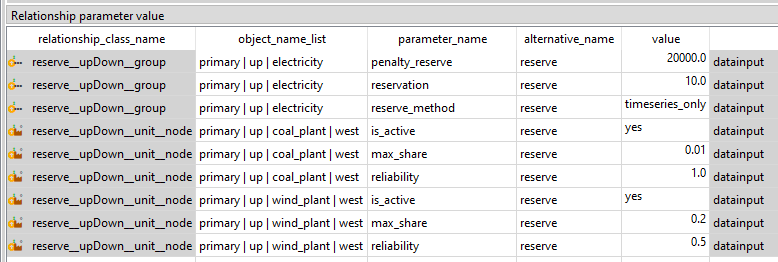
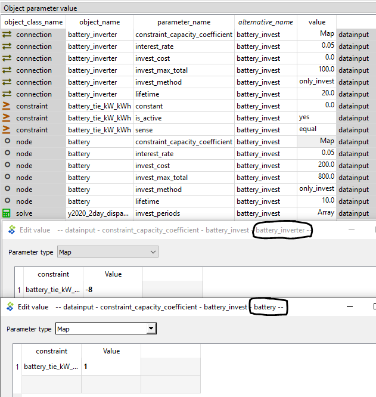
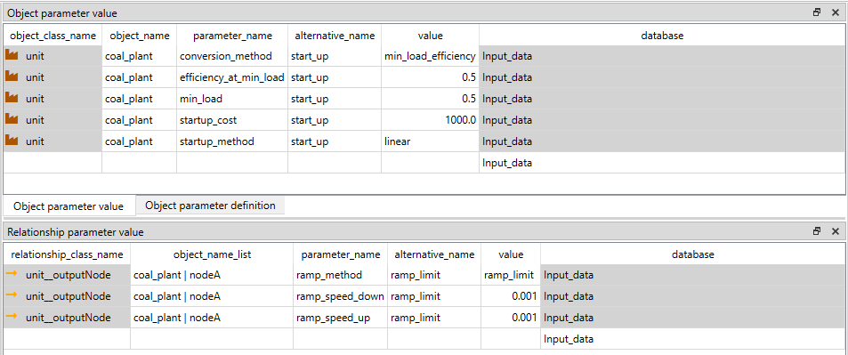
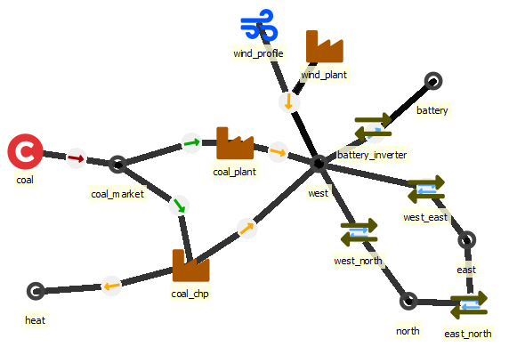
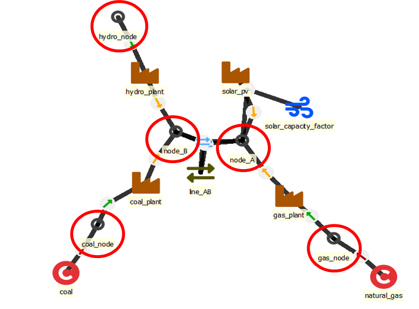

# IRENA FlexTool user guide and documentation

IRENA FlexTool is an energy systems optimisation model developed for power and energy systems with high shares of wind and solar power. It can be used to find cost-effective sources of flexibility across the energy system to mitigate the increasing variability arising from the power systems. It can perform multi-year capacity expansion as well as unit commitment and economic dispatch in a user-defined sequence of solves. The aim has been to make it fast to learn and easy to use while including lot of functionality especially in the time scales relevant for investment planning and operational scheduling of energy systems.

The instructions for installing IRENA FlexTool are [here](https://github.com/irena-flextool/flextool/tree/master#irena-flextool).

This user guide will build a small system step-by-step. After that, there is a reference section for model properties. The small system is also available in the repository ('Init.sqlite') and can be opened with Spine Toolbox database editor. It can also be run with IRENA FlexTool (initialize the Input_data.sqlite with the Init.sqlite in the Spine Toolbox workflow when testing the modelling framework). More information on how to set-up and use the Spine Toolbox front-end in [here](https://github.com/irena-flextool/flextool#irena-flextool-workflow-shortly-explained).

- [Building a small test system](#building-a-small-test-system)
  - [1st step - a node with no units](#1st-step---a-node-with-no-units)
  - [2nd step - add a coal unit](#2nd-step---add-a-coal-unit)
  - [3rd step - add a wind power plant](#3rd-step---add-a-wind-power-plant)
  - [4th step - add a network](#4th-step---add-a-network)
  - [5th step - add a reserve](#5th-step---add-a-reserve)
- [More functionality](#more-functionality)
  - [Adding a storage unit (battery)](#adding-a-storage-unit-battery)
  - [Adding battery investment capabilities](#adding-battery-investment-capabilities)
  - [Minimum load example](#minimum-load-example)
  - [Adding CO2 emissions and costs](#adding-co2-emissions-and-costs)
  - [Full year model](#full-year-model)
  - [A system with coal, wind, network, battery and CO2 over a full year](#a-system-with-coal-wind-network-battery-and-co2-over-a-full-year)
- [Essential objects for defining a power/energy system](#essential-objects-for-defining-a-powerenergy-system)
- [How to define model properties](#how-to-define-model-properties)
- [Additional objects for further functionality](#additional-objects-for-further-functionality)
- [Nodes](#nodes)
- [Units](#units)
- [Connections](#connections)
- [Commodities](#commodities)
- [Profiles](#profiles)
- 
## 1st step - a node with no units

At first the test system shows the parameters needed to establish a working model. However, this model has only one `node` (*west*) with demand, but no units to provide the demand. It will therefore use the upward slack variable and accept the `penalty_up` cost associated with it. All parameters here are part of the *init* `alternative` - they will be used whenever a `scenario` includes the *init* `alternative`.


## 2nd step - add a coal unit

In the second step, a coal unit is added. It needs `efficiency` and capacity (`existing`), but it also needs a new `node` *coal_market* from which it will get the *coal* `commodity` which needs a parameter for `price`. All these new parameters are part of the 'coal' `alternative`. A scenario with the initial node and the coal unit is then built by including both *init* and *coal* `alternatives` in the *coal* `scenario`. There are some extra parameters related to investments that will be useful later.


Furthermore, the model needs to know that there is a link between the *coal_market* and *coal_plant* as well as *coal_plant* and the `node` *west*. These are established as relationships between objects. `unit__inputNode` relationship will therefore have *coal_plant--coal_market* relationship and `unit__outputNode` will include *coal_plant--west* relationship.

## 3rd step - add a wind power plant

Next, a wind power plant is added. The parameters for this unit include `conversion_method`, `efficiency`, `existing` and `is_active`. Note that wind does not require a commodity, but instead uses a profile to limit the generation to the available wind. A *wind_profile* object is added to the `profile` object class and the parameter `profile` is given a map of values where each time step gets the maximum available capacity factor for the time step. On the bottom of the the figure, the relationship class `unit__node__profile` gets a new member *wind_plant, west, wind_profile*, which tells the model to connect the *wind_profile* with the flow going from the *wind_plant* to the *west* `node`. There is also a parameter `profile_method` given to *wind_plant, west, wind_profile* relationship with the choice *upper_limit* selected. Now the *wind_plant* must generate at or below its capacity factor.


## 4th step - add a network

 A *network* `alternative` introduces two new `nodes` (*east* and *north*) and three new `connections` between `nodes` (*east_north*, *west_east* and *west_north*). The new nodes are kept simple: they just have a constant negative `inflow` (i.e. demand) and penalty values for violating their energy balance, which is also required through the `has_balance` parameter. The *north* `node` has the lowest upward penalty, so the model will prefer to use that whenever the *coal* and *wind* units cannot meet all the demand. Sometimes the `existing` capacity of the new `connections` will not be sufficient to carry all the needed power, since both generators are producing to the *west* `node`.

 

 ## 5th step - add a reserve

Reserve requirement is defined for a group of nodes. Therefore, the first step is to add a new `group` called *electricity* with *west*, *east* and *north* as its members using the `group__node` relationship class. Then, a new reserve category called *primary* is added to the `reserve` object class. 

A relationship between *primary--up--electricity* in the `reserve__upDown__group` class allows to define the reserve parameters `reserve_method`, `reservation` and `penalty_reserve`. In this case the reserve requirement will be a constant even though the `reserve_method` is *timeseries_only*. The other alternative is dynamic reserves where the model calculates the reserve requirement from generation and loads according to user defined factors (`increase_reserve_ratio`). 

Parameters from the `reserve__upDown__unit__node` class will be used to define how different units can contribute to different reserves. Parameter `max_share` says how large share of the total capacity of the unit can contribute to this reserve category (e.g. *coal_plant*, in this example, has ramping restrictions and can only provide 1% of it's capacity to this upward primary reserve. Meanwhile, parameter `reliability` affects what portion of the reserved capacity actually contributes to the reserve (e.g. in this contrived example, *wind_plant* must reduce output by 20 MW to provide 10 MW of reserve). 

 

# More functionality

## Adding a storage unit (battery)

***init - wind - battery***

In the init.sqlite, there is a `scenario` *wind_battery* - the *wind_plant* alone is not able to meet the load in all conditions, but the *battery* will help it to improve the situation.

In FlexTool, only `nodes` can have storage. This means that `existing` capacity and all investment parameters for `nodes` refer to the amount of storage the `node` can have. In this example, a *battery* `node` is established to describe the storage properties of the *battery* (e.g. `existing` capacity and `self_discharge_loss` in each hour). 

Battery also needs charging and discharging capabilities. These could be presented either with a `connection` or by having a charging `unit` and a discarging `unit`. In here, we are using a `connection` called *batter_inverter*, since its more easy to prevent simultaneous charging and discharging that way (although, in a linear model, this cannot be fully prevented since that requires an integer variable). Please note that the `efficiency` parameter of the `connection` applies to both directions, so the round-trip `efficiency` will be `efficiency` squared.

The `transfer_method` can be used by all types of connections, but in this case it is best to choose *regular*, which tries to avoid simultaneous charging and discharing, but can still do it when the model needs to dissipate energy. *exact* method would prevent that, but it would require integer variables and make the storage computationally much more expensive. Model leakage will be reported in the results (forthcoming).


##  Adding battery investment capabilities 

***init - wind - battery - battery_invest***

To make the *wind_battery* `scenario` more interesting, an option to invest in *battery* and *battery_inverter* is added. It also demonstrates how FlexTool can have more complicated constraints that the user defines through data. 

First, the investment parameters need to be included both for the *battery_inverter* and *battery* objects:

- `invest_method` - the modeller needs to choose between *only_invest*, *only_retire*, *invest_and_retire* or *not_allowed*
- `invest_cost` - overnight investment cost new capacity [currency/kW] for the *battery_inverter* and [currency/kWh] for the *battery*. Other one can be left empty or zero, since they will be tied together in the next phase. Here we will assume a fixed relation between kW and kWh for this battery technology, but for example flow batteries could have separate investments for storage and charging capacities.
- `invest_max_total` - maximum investment (power [MW] or energy [MWh]) to the virtual capacity of a group of units or to the storage capacity of a group of nodes. This should not be empty or zero, since then the model cannot invest in the technology.
- `interest_rate` - an interest rate [e.g. 0.05 means 5%] for the technology that is sufficient to cover capital costs assuming that the economic lifetime equals the technical lifetime
- `lifetime` - technical lifetime of the technology to calculate investment annuity (together with interest rate)

Second, a new constraint needs to be created that ties together the storage capacity of the *battery* and the charging/discharging capacity of the *battery_inverter*. A new `constraint` object *battery_tie_kW_kWh* is created and it is given parameters `constant`, `is_active` and `sense`. Constant could be left out, since it is zero, but `is_active` must be defined in order to include the constraint in the *battery_invest* `alternative`. The `sense` of the constraint must be *equal* to enforce the kw/kWh relation.

Third, both *battery_inverter* and *battery* need a coefficient to tell the model how they relate to each other. The equation has the capacity variables on the left side of the equation and the constant on the right side.

```
sum_i(`constraint_capacity_coefficient` * `invested_capacity`) = `constant` 
      where i is any unit, connection or node that is part of the constraint
```

When the `constraint_capacity_coefficient` for *battery* is set at 1 and for the *battery_inverter* at -8, then the equation will force *battery_inverter* `capacity`to be 8 times smaller than the *battery* `capacity`. The negative term can be seen to move to the right side of the equation, which yields:

```1 x *battery* = 8 x *battery_inverter*, which can be true only if *battery_inverter* is 1/8 of *battery*```

`constraint_capacity_coefficient` is not a parameter with a single value, but a map type parameter (index: constraint name, value: coefficient). It allows the object to participate in multiple constraints.

Finally, FlexTool can actually mix three different types of constraint coefficients: `constraint_capacity_coefficient`, `constraint_state_coefficient` and `constraint_flow_coefficient` allowing the user to create custom constraints between any types of objects in the model for the main variables in the model (*flow*, *state* as well as *invest* and *divest*). So, the equation above is in full form:

```
  + sum_i [constraint_capacity_coefficient(i) * invested_capacity]
           where i contains [node, unit, connection] belonging to the constraint
  + sum_j [constraint_flow_coefficient(j) * invested_capacity]
           where j contains [unit--node, connection--node] belonging to the constraint
  + sum_k [constraint_state_coefficient(k) * invested_capacity] 
           where k contains [node] belonging to the constraint
  = 
  constant
```



## Combined heat and power (CHP) example

***init - coal_chp - heat***

This CHP plant is an another example where the user defined `constraint` (see the last equation in the previous example) is used to achieve derised behaviour. In a backpressure CHP, heat and power outputs are fixed - increase one of them, and you must also increase the other. In an extraction CHP plant the relation is more complicated - there is an allowed operating area between heat and power. Both can be depicted in FlexTool, but here a backpressure example is given. An extraction plant would require two or more *greater_than* and/or *lesser_than* `constraints` to define an operating area.

First, a new *heat* `node` is added and it is given the necessary parameters. Then the *coal_chp* `unit` is made with a high `efficiency` parameter, since CHP units convert fuel energy to power and heat at high overall rates. In FlexTool, `efficiency` is a property of the unit - it demarcates at what rate the sum of inputs is converted to the sum of outputs. However, without any additional constraints, the `unit` is free to choose in what proportion to use inputs and in which proportion to use outputs. In units with only one input and output, this freedom does not exist, but in here, the *coal_chp* needs to be constrained as otherwise the unit could produce electricity at 90% efficiency, which is not feasible. 

This is done by adding a new `constraint` *coal_chp_fix* where the heat and power co-efficients are fixed. As can be seen in the bottom part of the figure below, the `constraint_flow_coefficient` parameter for the *coal_chp--heat* and *coal_chp--west* is set as a map value where the `constraint` name matches with the *coal_chp_fix* `constraint` object name. The values are set so that the constraint equation forces the heat output to be twice as large as the electricity output. Again, the negative value moves the other variable to the right side of the equality, creating this:

```1 x *electricity* = 0.5 x *heat*, which is true only if *heat* is 2 x *electricity*```


## Minimum load example

***init - coal - coal_min_load***

The next example is more simple. It adds a minimum load behavior to the *coal_plant* `unit`. Minimum load requires that the unit must have an online variable in addition to flow variables and therefore a `startup_method` needs to be defined and an optional `startup_cost` can be given. The options are *no_startup*, *linear* and *binary*. *binary* would require an integer variable so *linear* is chosen. However, this means that the unit can startup partially. The minimum online will still apply, but it is the minimum of the online capacity in any given moment (*flow* >= *min_load* x *capacity_online*).

The online variable also allows to change the efficiency of the plant between the minimum and full loads. An unit with a part-load efficiency will obey the following equation:

```
  + sum_i[ input(i) * input_coefficient(i) ]
  =
  + sum_o[ output(o) * output_coefficient(o) ] * slope
  + online * section

where   slope = 1 / efficiency - section
  and section = 1 / efficiency 
                - ( 1 / efficiency - 1 / efficiency_at_min_load) / ( 1 - efficiency_at_min_load )
```

By default, `input_coefficient` and `output_coefficient` are 1, but if there is a need to tweak their relative contributions, these coefficients allow to do so (e.g. a coal plant might have lower efficieny when using lignite than when using brown coal).



## Adding CO2 emissions and costs

***init - coal - co2***

Carbon dioxide emissions are added to FlexTool by associating relevant `commodities` (e.g. *coal*) with a `co2_content` parameter (CO2 content per MWh of energy contained in the fuel). To set a price for the CO2, the nodes that use those commodities will need to be linked to a `group` of `nodes` that set the `co2_price` (currency / CO2 ton). Therefore, in addition to what is visible in the figure below, a relationship *co2_price--coal_market* must be established so that the model knows to point the `CO2_price` to the `commodity` used from the *coal_market* `node` based on the `co2_content` of the *coal* `commodity`.


## Full year model

***init - fullYear***

So far the model has been using only two days to keep it fast to run. This example extends the model horizon to a full year. To do so, a new `solve` object *y2020_fullYear_dispatch* is added. Each `solve` object needs to know what `periods` it will contain and what `periods` it will realize (print out results). `solve_mode` does not do anything at present, but will be used when FlexTool can be set to do automatic rolling window optimization (at present, it needs to be set manually using multiple solves). The key difference here is that the `period_timeblockSet` parameter points the *p2020* period to a timeblockSet definition that covers the full year instead of the two days used before.


## A system with coal, wind, network, battery and CO2 over a full year

***init - coal - wind - network - battery - co2 - fullYear***

The final example shows a system many of the previous examples have been put into one model and run for one year. The graph below shows the physical objects in the example.



# Essential objects for defining a power/energy system

- [**node**](#nodes): maintain a balance between generation, consumption, transfers and storage state changes (nodes can also represent storages)
- [**unit**](#units): power plants or other conversion devices that take one or more inputs and turn them into one or more outputs
- [**connection**](#connections): transmission lines or other transfer connections between nodes
- [**commodity**](#commodities): fuels or other commodities that are either purchased or sold at a price outside of the model scope
- [**profile**](#profiles): timeseries that can be used to constraint the behaviour of units, connections or storages

See below for more detailed explanations.


# How to define model properties

## Timesteps and periods

FlexTool has two different kinds of time varying parameters. The first one represents a regular timeline based on timesteps. The duration of each timestep can be defined by the user. There can be multiple timelines in the database - the user needs to define which timeline to use (and what parts of the timeline should be used, as will be explained later). The timestep names in the timeline are defined by the user - they can be abstract like 't0001' or follow a datetime format of choice. However, the timestep names between different timelines must remain unique.

The second time varying dimension is `period`, which is typically used to depict assumptions about the future. One model can include multiple `solves` that the model will solve in sequence (to allow multi-stage modelling). Each solve can include multiple `periods` (so that the user can change parameter values for different parts of the future).

A parameter of particular type can be either constant/time-varying or constant/period-based. For example `inflow` is either a constant or time-varying, but it cannot be period-based.

## Timeblocksets

Timeblocks pick one or more sections from the `timeline` to form a `timeblockset`. Each timeblock defines a start and a duration. The aim of timeblocksets is to allow the modeller to create models with represeantive periods often used in the investment planning.

## Definitions

- **model**: model defines the sequence of solves to be performed (e.g. first an investment solve and then a dispatch solve)
  - *solves*: sequence of solves in the model represented with an array of solve names.
- **solve**: each solve is built from an array of periods (e.g. one period for 2025 and another for 2030). Periods use timeblocksets to connect with a timeline.
  - *period_timeblockset*: map of periods with associated timeblocks that will be included in the solve. Index: period name, value: timeblockSet name.
  - *realized_periods*: these are the periods the model will 'realize' - i.e., what periods will be reported in the results from this solve
  - *invest_periods*: array of periods where investements are allowed in this solve (applies only to objects that can be invested in)
  - *discount_years*: how far in the future each period is from the start of this solve (in years). Index: period, value: years.
  - *solver*: choice of solver (a list of possible values)
  - *solve_mode*: a single shot or a rolling solve (not functional yet, always a single shot)
- **timeblockset**: timeblocksets are sets of timeblocks with a start (from timeline) and a duration (number of time steps)
  - *block_duration* a map with index *timestep_name* that starts the timeblock and value that defines the duration of the block (how many timesteps)
- **timeline**: continuous timeline with a user-defined duration for each timestep. Timelines are used by time series data.
  - *timestep_duration*: a map with *timestep_name* as an index and *duration* as a value.
  - *timeline_duration_in_years* Total duration of the timeline in years. Used to relate operational part of the model with the annualized part of the model.
- **timeblockset__timeline**: defines which timeline object particular timeblockset is using.


# Additional objects for further functionality
- **group**: include multiple objects in a group to define common constraints (e.g. minimum VRE share)
- **reserve**: to define reserves for power systems
- **constraint**: to create user defined constraints between flow, state, and capacity variables (for nodes, units and connections)

# Nodes

## Defining how the node functions

These parameters will define how the node will behave and use the data it is given (available choices are marked in *italics*):

- **'name'** - unique name identifier (case sensitive)
- **'is_active'** - is the model/node/unit active in a specific scenario: *yes* (if not defined, then not active)
- **'has_balance'** - does the node maintain a balance for inputs and outputs: *yes* (if not defined, then balance is not maintained)
- **'has_state'** - does the node represent a storage and therefore have a state: *yes* (if not defined, then no storage)
- **'invest_method'** - choice of investment method
    - *only_invest* 
    - *only_retire* 
    - *invest_and_retire* 
    - *not_allowed* 
- **'inflow_method'** - choice how to treat inflow time series
    - *use_original* - does not scale the original time series (no value defaults here)
    - *no_inflow* - ignores any inserted inflow time series
    - *scale_to_annual_flow* - will scale the time series to match the `annual_flow` so that the sum of inflow is multiplied by 8760/`hours_in_solve`
    - *scale_in_proprotion* - calculates a scaling factor by dividing `annual_flow` with the sum of time series inflow (after it has been annualized using `timeline_duration_in_years`)



## Data for nodes

Input data is set with the following parameters:

- **'inflow'** - inflow into the node (negative is outflow). Constant or time series.
- **'annual_flow'** - annual flow in energy units (always positive, the sign of inflow defines in/out). Constant or period.
- **'existing'** - existing storage capacity (requires `has_state`). Constant.
- **'invest_cost'** - investment cost for new storage capacity. Constant or period.
- **'invest_max_total'** - maximum investment over all solves. Constant.
- **'lifetime'** - life time of the storage unit represented by the node. Constant or period.
- **'interest_rate'** - interest rate for investments. Constant or period.
- **'fixed_cost'** - annual fixed cost for storage. Constat or period.
- **'penalty_up'** - penalty cost for decreasing consumption in the node with a slack variable. Constant or time.
- **'penalty_down'** - penalty cost for increasing consumption in the node with a slack variable. Constant or time.

# Units

Units convert energy (or matter) from one form to another (e.g. open cycle gas turbine), but the can also have multiple inputs and/or outputs (e.g. combined heat and power plant). The input nodes are defined with the relationship `unit--inputNode` while the output nodes are defined through the relationship `unit--outputNode`.

## Defining how the unit functions

- `is_active` to state the alternative where the unit becomes active
- 'conversion_method' to define the way unit converts inputs to outputs 
- `startup_method` defines how the start-up mechanism is modelled
- `minimum_time_method` - not functional at the moment

## Main data items for units

- Capacity: `existing` (and the investment and retirement parameters below)
- Technical: `efficiency`, `min_load`, `efficiency_at_min_load`, `inertia_constant`
- Economic: `variable_cost`, `startup_cost`, `fixed_cost` (fuel cost comes through the use of fuel commodities)

## Investment parameters (for capacity expansion)

- investment/retirement method
- invest_cost, interest_rate, lifetime, invest_max_total, invest_max_period
- salvage_cost, retire_max_total, retire_max_period


## Relationship of a unit to a node and determination of the type of relationship

- If the unit’s outputs are flowing into the node, the node acts as output for the unit.
- If the unit’s inputs are flowing out of the node (into the unit), the node acts as input for the unit.
- Not all units necessary have an input or an output node. E.g. VRE generators have only output nodes and their generation is driven by profiles

## Properties of unit--inputNode and unit--outputNode relationships

- Flow (from/to node) coefficient (changes the accounts for efficiency of unit)
- Variable cost of the particular flow of unit--inputNode or unit--outputNode

## Units constrained by profiles

Some generators (e.g. VRE) are not converting energy from one node to the other. Instead, their generation is determined (or limited) by a specific generation profile set by a `profile` object with a `profile_method`, thats state whether the profile forces an *upper_limit*, *lower_limit* or *equal*ity. Finally `profile`object is given a `profile` time series (or it can also be a constant).

# Connections

Connections can have an `existing` transfer capacity as well as an opportunity to invest in new capacity and retire old capacity. The functional choices of connections include the `is_active`, `transfer_method`, `invest_method`, `startup_method` as well as a choice if the tranfer connection `is_DC`. Parameters for the connection are defined in the `connection` object, but the two `nodes` it connects are defined by establishing a relationship between `connection--leftNode--rightNode`.

# Commodities

Some `nodes` can act as a source or a sink of commodities instead of forcing a balance between inputs and outputs. To make that happen, commodities must have a `price` and be connected to those `nodes` that serve (or buy) that particular `commodity` at the given `price`. In other words, `commodity` is separate from `node` so that the user can use the same `commodity` properties for multiple nodes. Commodities can also have a `co2_content`. The `commodity` and its `nodes` are connected by establishin a new relationship between the `commodity` and each of its `nodes` (e.g. *coal--coal_market*).


# Profiles

Profiles are time series of data that will be multiplied by capacity to form a constraint for a unit flow, a connection flow or a storage state. The constraint can be *upper_limit*, *lower_limit* or *fixed*.
