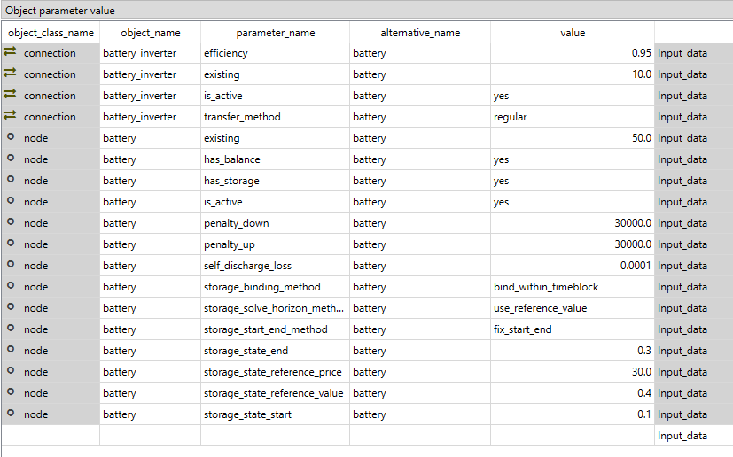
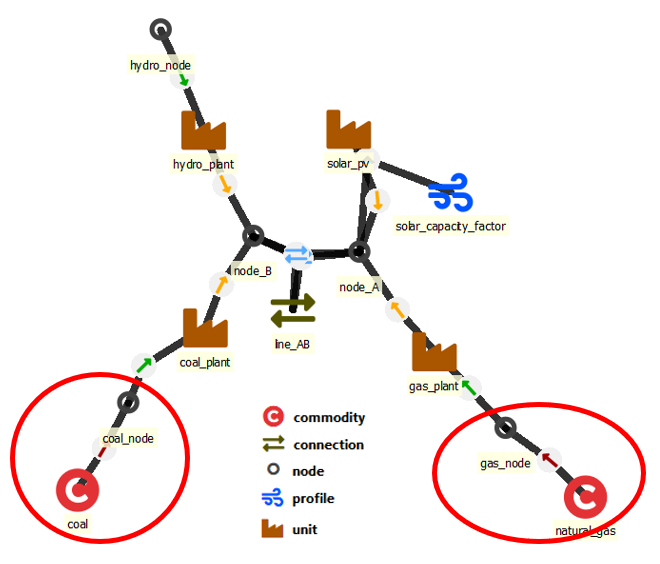

# IRENA FlexTool user guide and documentation

IRENA FlexTool is an energy systems optimisation model developed for power and energy systems with high shares of wind and solar power. It can be used to find cost-effective sources of flexibility across the energy system to mitigate the increasing variability arising from the power systems. It can perform multi-year capacity expansion as well as unit commitment and economic dispatch in a user-defined sequence of solves. The aim has been to make it fast and easy to use while including lot of functionality especially in the time scales relevant for investment planning and operational scheduling of energy systems.

The instructions for installing IRENA FlexTool are [here](https://github.com/irena-flextool/flextool/tree/master#irena-flextool).

This user guide will build a small system step-by-step. After that, there is a reference section for model properties. The small system is also available in the repository ('Init.sqlite') and can be opened with Spine Toolbox database editor. It can also be run with IRENA FlexTool (in the Spine Toolbox workflow one can initialize the Input_data.sqlite with the Init.sqlite when testing the modelling framework). More information on how to set-up and use the Spine Toolbox front-end in [here](https://github.com/irena-flextool/flextool#irena-flextool-workflow-explained).

# Building a small test system

## 1st step - a node with no units

At first the test system shows the parameters needed to establish a working model. However, this model has only a `node` (*west*) with demand, but no units to provide the demand. It will therefore use the slack variables and accept the penalty associated with them. All parameters here are part of the 'init' `alternative` - they will be used whenever a `scenario` includes the 'init' `alternative`.

## 2nd step - add a coal unit

In the second step, a coal unit is added. It needs `efficiency` and capacity (`existing`), but it also needs a new `node` *coal_market* from which it will get the *coal* `commodity` which needs a parameter for `price`. All these new parameters are part of the 'coal' `alternative`. A scenario with the initial node and the coal unit is then built by including both 'init' and 'coal' `alternatives` in the 'coal' `scenario`. There are some extra parameters related to investments that will be useful later.

Furthermore, the model needs to know that there is a link between the *coal_market* and *coal_plant* as well as *coal_plant* and the `node` 'west'. These are established as relationships between objects. `unit__inputNode` relationship will therefore have 'coal_plant, coal_market' relationship and `unit__outputNode` will include 'coal_plant, west' relationship.

## 3rd step - add a wind power plant

Next, a wind power plant is added. The parameters for this unit include `conversion_method`, `efficiency`, `existing` and `is_active`. Note that wind does not require a commodity, but instead uses a profile to limit the generation to the available wind. A *wind_profile* object is added to the `profile` object class and the parameter `profile` is given a map of values where each time step gets the maximum available capacity factor for the time step. On the bottom of the the figure, the relationship class `unit__node__profile` gets a new member *wind_plant, west, wind_profile*, which tells the model to connect the *wind_profile* with the flow going from the *wind_plant* to the *west* `node`. There is also a parameter `profile_method` given to *wind_plant, west, wind_profile* relationship with the choice *upper_limit* selected. Now the *wind_plant* must generate at or below its capacity factor.

## 4th step - add a network

 A *network* `alternative` introduces two new `nodes` (*east* and *north*) and three new `connections` between `nodes` (*east_north*, *west_east* and *west_north*). The new nodes are kept simple: they just have a constant negative `inflow` (i.e. demand) and penalty values for violating their energy balance, which is also required through the `has_balance` parameter. The *north* `node` has the lowest upward penalty, so the model will prefer to use that whenever the *coal* and *wind* units cannot meet all the demand. Sometimes the `existing` capacity of the new `connections` will not be sufficient to carry all the needed power, since both generators are producing to the *west* `node`.

 

 ## 5th step - add a reserve

 Primary reserves (`reserve__upDown__group` and ` reserve__upDown__unit__node`) can be added with parameters `penalty_reserve`, `reservation`, `reserve_method`, `is_active`, `max_share`, `reliability` and `profile_method`. The values for `reserve_method` can be *no_reserve*, *timeseries_only*, *dynamic_only* or *both*. 

 

# Other functionalities

## Adding a battery

Batteries are connected to inverters with `battery_inverter` objects involving parameters `efficiency` (between 0 and 1), `existing` (describing existing capacity), `is_active` and `transfer_method` which can be *regular*, *no_losses_no_variable_cost*, *exact* or *variable_cost_only*. Battery node parameters include e.g. `self_discharge_loss`, `penalty_up` and `penalty_down`.

##  Adding battery investment capabilities

Battery investment capabilities can be modelled by adding parameters to the `battery_inverter` object for:

- `invest_cost` - cost per added power,
- `invest_max_total` - maximum investment (energy or power) to the virtual capacity of a group of units or to the storage capacity of a group of nodes
- `interest_rate` - i.e. discount rate,
- `lifetime` - used together with `interest_rate` to calculate annuity,
- `invest_method` - allows the values *only_invest*, *only_retire*, *invest_and_retire* or *not_allowed*, and
- `constraint_capacity_coefficient` - a map of coefficients (index: constraint name, value: coefficient) to represent the participation of the connection capacity in user-defined constraints.

# Essential objects for defining a power/energy system

- **nodes**: maintain a balance between generation, consumption, transfers and storage state changes (nodes can also represent storages)
- **units**: power plants or other conversion devices that take one or more inputs and turn them into one or more outputs
- **connections**: transmission lines or other transfer connections between nodes
- **commodities**: fuels or other commodities that are either purchased or sold at a price outside of the model scope
- **profiles**: timeseries that can be used to constraint the behaviour of units, connections or storages

See below for more detailed explanations.

# Essential objects to define model properties

- **model**: model defines the sequence of solves to be performed (e.g. first an investment solve and then a dispatch solve)
- **solve**: each solve is built from an array of periods (e.g. one period for 2025 and another for 2030). Periods use timeblocksets to connect with a timeline.
- **timeblockset**: timeblocksets are sets of timeblocks with a start (from timeline) and a duration (number of time steps)
- **timeline**: continuous timeline with a user-defined duration for each timestep. Timelines are used by time series data.
 
# Additional objects for further functionality
- **group**: include multiple objects in a group to define common constraints (e.g. minimum VRE share)
- **reserve**: to define reserves for power systems
- **constraint**: to create user defined constraints between flow, state, and capacity variables (for nodes, units and connections)

# Nodes

## Defining how the node functions

These parameters will define how the node will behave and use the data it is given (available choices are marked in *italics*):

- **'name'** - unique name identifier (case sensitive)
- **'is_active'** - is the model/node/unit active in a specific scenario: *yes* (if not defined, then not active)
- **'has_balance'** - does the node maintain a balance for inputs and outputs: *yes* (if not defined, then balance is not maintained)
- **'has_state'** - does the node represent a storage and therefore have a state: *yes* (if not defined, then no storage)
- **'invest_method'** - choice of investment method
    - *only_invest* 
    - *only_retire* 
    - *invest_and_retire* 
    - *not_allowed* 
- **'inflow_method'** - choice how to treat inflow time series
    - *use_original* - does not scale the original time series (no value defaults here)
    - *no_inflow* - ignores any inserted inflow time series
    - *scale_to_annual_flow* - will scale the time series to match the `annual_flow` so that the sum of inflow is multiplied by 8760/`hours_in_solve`
    - *scale_in_proprotion* - calculates a scaling factor by dividing `annual_flow` with the sum of time series inflow (after it has been annualized using `timeline_duration_in_years`)

## Data

Input data is set with the following parameters:

- **'inflow'** - inflow into the node (negative is outflow). Constant or time series.
- **'annual_flow'** - annual flow in energy units (always positive, the sign of inflow defines in/out). 
- **'existing'** - existing storage capacity (requires `has_state`)
- **'invest_cost'** - investment cost for new storage capacity. Constant or time series.
- **'penalty_up'** - penalty cost for decreasing consumption in the node with a slack variable
- **'penalty_down'** - penalty cost for increasing consumption in the node with a slack variable

# Commodities

Commodities are characterized by their price and CO2 content. Commodities are not directly injected to units (e.g. coal to the coal plant) so to be useful, they need to be assigned to commodity nodes (e.g. coal_node, gas_node). 

# Connections

Connections have a name and a transfer capacity. Their operational characteristics include the transfer method, startup method, DC or AC and efficiency.

- **'left_node' and 'right_node'**
- **'is_active'**
- **'transfer_method'** - *regular*
- **'startup_method'** - *no_startup*
- **'invest_method'**
- **'is_DC'**
    - *yes*, *no*

Investment parameters (for capacity expansion): investment method, investment cost, interest rate, lifetime. Retirement possible

# Units

Units convert energy (or matter) from one form to another (e.g. open cycle gas turbine).

Units definition

- Unit names (e.g. coal_plant, hydro_plant, solar_pv), capacities.

variable_cost

Operational characteristics

- Energy conversion method (conversion_method), startup method (startup_method), minimum up/down time method (minimum_time_method)
- Technical: Minimum load (min_load), efficiency, efficiency at min load (efficiency_at_min_load), minimum up/down time
- Economic: Variable O&M cost, startup cost.
- is_active

Investment parameters (for capacity expansion)

- Investment method, investment cost, interest rate, lifetime
- Retirement possible

Generators are associated with nodes.

## Relationship of a unit to a node and determination of the type of relationship:

- If the unit’s outputs are flowing into the node, the node acts as output for the unit.
- If the unit’s inputs are flowing out of the node (into the unit), the node acts as input for the unit.
- Not all units necessary have an input node. E.g. VRE generators have only output nodes and their generation is driven by profiles (next slide).

## Relationship properties:

- Flow (from/to node) coefficient (accounts for efficiency of unit)
- Variable cost of flow

Generators are associated with nodes.

### Generators driven by profiles

Some generators (e.g. VRE) are not converting energy from one node to the other. Instead, their generation is determined (or limited) by a specific generation profile.

Association of profile-unit and determination of profile method.

- profile: solar_capacity_factor, ...
- profile_method: upper_limit, ...

# Defining a battery

In Flextool 3, batteries are modeled with 
- 1 battery node, which represents the storage capacity (MWh) of the battery (energy part of the battery)
- 1 connection which transfers energy to and from the battery node (power part of the battery)

Storage specific parameters of a node: has_state (has storage), existing (MWh), self_discharge_loss

- **self_discharge_loss**
- **virtual_unitsize**
- **transfer_method**
- **fixed_cost**
- **variable_cost**
- **efficiency**

