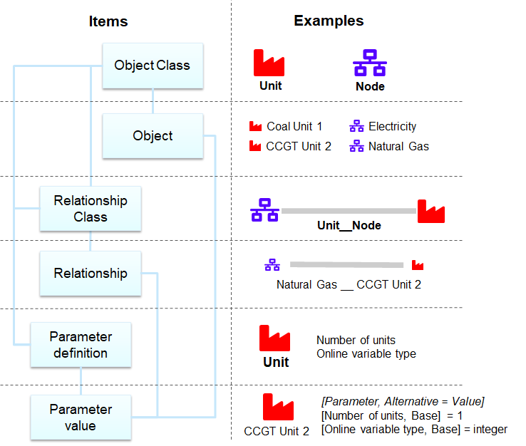

# IRENA FlexTool workflow shortly explained

IRENA FlexTool workflow is a Spine Toolbox workflow that can be modified by the user. The workflow provided in the repository is a template Spine Toolbox project that can be **either** copied for local changes **or** the workflow data input data files can be switched to local files. It is also possible to work directly with the template, but then one needs to be careful when pulling a new version of IRENA FlexTool since that can overwrite local changes (the input data file contents need to be copied to safety before updating). 

If you are using the **IRENA FlexTool browser-interface**, then you will not directly see the Spine Toolbox workflow, but the FlexTool web-server will be executing parts of the workflow in the background as you develop and run the model.

The panel on the right shows the different `scenarios` that are available in the database. 
The user can choose which scenarios will be processed by the workflow (until item ***Results***, 
which combines the results into one database). Spine Toolbox can execute scenarios in parallel 
(as long as using 'work directories' is defined in ***FlexTool*** item).

***Input data*** workflow item points to a sqlite file that needs to have IRENA FlexTool data format 
(that uses Spine Toolbox database definition). The template file has the right format and contains
empty object classes corresponding to FlexTool data structure as well as parameters available 
in each object class. Double clicking the ***Input data*** workflow item will open the database editor. 
Just selecting the ***Input data*** workflow item allows one to change the file (make a copy of the 
existing Input_data.sqlite using the file system of your OS and point to the copy).

***Init*** workflow item points to a sqlite file with predefined data that showcases IRENA FlexTool 
functionality. Some of the scenarios from there are used in the user guide. ***Initialize*** 
copies the contents of the ***Init*** database to the ***Input data*** database. The scenario filter in the arrow after the ***Init*** database can be used to choose what data will be copied.

***Export_to_csv*** workflow item is a Spine Toolbox exporter that has been set to write csv files that IRENA FlexTool model code will read.

***FlexTool*** workflow item contains a Python script that calls FlexTool model code for each solve 
and passes data between these solves. FlexTool model is written in MathProg and it calls HiGHS 
solver by default to solve the model. The outputs are csv files.

***Import_results*** is a Spine Toolbox importer that takes the output csv files and writes them 
in the Results database.

***Excel_input_data*** and ***Import_from_Excel*** allow users to use Excel as an interface for the input data. 
They are optional parts of the workflow.

***To_Excel*** worfklow item will export most scenario results to a simple Excel file. One way to utilize 
this is by creating another Excel file that draws figures from the result Excel file that is then updated by the workflow.

The browser interface of FlexTool also runs part of this same workflow 
(***Export_to_csv*** --> ***FlexTool*** --> ***Import_results***). The server takes a copy of the workflow (inside the user_projects) 
folder and uses Spine Toolbox to execute the scenarios.

More instructions for Spine Toolbox in [Toolbox User Guide](https://spine-toolbox.readthedocs.io/en/latest/?badge=latest).

# Data structure in Spine databases

Spine databases use Entity-Attribute-Value with Classes and Relationships (EAV-CR). Entity classes define the categories of data. These can be one-dimensional object classes (e.g. `node` or `unit`) or multi-dimensional relationship classes formed from the object classes (e.g. `unit__node`). Spine Toolbox user can define these classes to suit their modelling needs. For FlexTool the entity classes have been pre-defined. Instead, FlexTool user needs to add the entity instances: objects and relationships that define the particular network structure to be modelled (e.g. *coal_plant* `unit` or *west* `node`). Furthermore, each entity class (object or relationship) can hold only parameters that have been defined for that particular class. Again, FlexTool user does not need to add the parameter types - the user should just add needed parameter values for the entities the user has created.

## Database editor in brief

Spine Toolbox database editor can be used to modify data and to build scenarios. 
The figure below shows an example where parameter data from two `alternatives` 
have been selected for display (in the data table). The object tree on the left 
selects two `nodes` ('coal_market' and 'west') as well as one `unit` ('coal_plant'). 
Consequently, one can use both whole classes and individual entities (members of the classes) as data filters.
The results of this filter are visualized in the graph on top. The mouse pointer is showing a relationship 
entity that connects the 'coal_plant' and its output `node` 'west'. The relationship 
entity is defined in a relationship tree, which is not visible here.

The `scenario` tree (on the right, below the `alternative` tree) shows that 
the 'coal' `scenario` is formed by taking all data from the 'init' `alternative` 
and then all data from the 'coal' `alternative`. If there would be same parameter 
defined for both `scenarios`, then the latter `alternative` would overwrite 
the first `alternative`.

Whenever data is modified, the data is staged in separate database tables (although not directly visible to user). The changes will be applied only once the user `commits` the changes and leaves a commit message to indicate what has been done. The `commit` can be done with ctrl-enter or from the database editor menu (triple bar at top-right).

The database editor menu has options for how to display the data: table view, different pivot views and a graph view. It also contains a tool to delete data (`purge`) and decrease database size by removing unused allocations (`vacuum`). You can also bring back dock windows that have been closed by the user. `History` will show the history of data changes based on the commits made by the user.

More on Spine Database editor in [Database Editor User Guide](https://spine-toolbox.readthedocs.io/en/latest/spine_db_editor/index.html).
