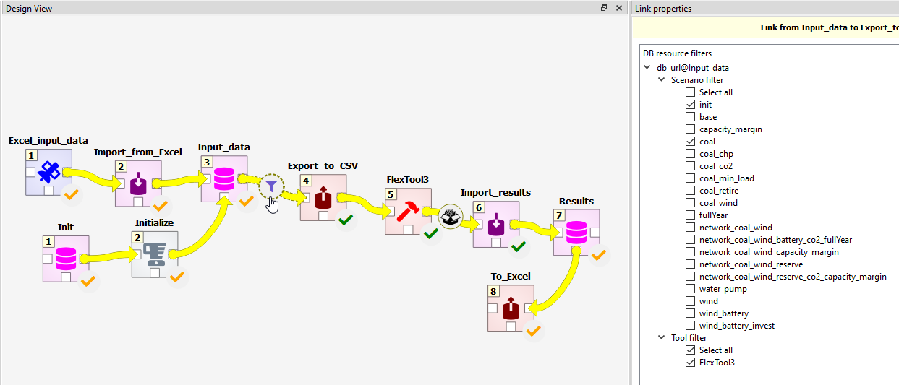

[Install](https://github.com/irena-flextool/flextool/tree/master#irena-flextool) | [Tutorial](https://irena-flextool.github.io/flextool) | [Reference](https://irena-flextool.github.io/flextool/reference) | [Data structure](https://irena-flextool.github.io/flextool/spine_database) | [Spine Toolbox interface](https://irena-flextool.github.io/flextool/spine_toolbox) | [Browser-interface](https://irena-flextool.github.io/flextool/browser_interface)

## IRENA FlexTool workflow shortly explained

IRENA FlexTool workflow is a Spine Toolbox workflow that can be modified by the user. The workflow provided in the repository is a template Spine Toolbox project that can be **either** copied for local changes **or** the workflow data input data files can be switched to local files. It is also possible to work directly with the template, but then one needs to be careful when pulling a new version of IRENA FlexTool since that can overwrite local changes (the input data file contents need to be copied to safety before updating). 

If you are using the **IRENA FlexTool browser-interface**, then you will not directly see the Spine Toolbox workflow, but the FlexTool web-server will be executing parts of the workflow in the background as you develop and run the model.

The panel on the right shows the different `scenarios` that are available in the database. 
The user can choose which scenarios will be processed by the workflow (until item ***Results***, 
which combines the results into one database). Spine Toolbox can execute scenarios in parallel 
(as long as using 'work directories' is defined in ***FlexTool*** item).

***Input data*** workflow item points to a sqlite file that needs to have IRENA FlexTool data format 
(that uses Spine Toolbox database definition). The template file has the right format and contains
empty object classes corresponding to FlexTool data structure as well as parameters available 
in each object class. Double clicking the ***Input data*** workflow item will open the database editor. 
Just selecting the ***Input data*** workflow item allows one to change the file (make a copy of the 
existing Input_data.sqlite using the file system of your OS and point to the copy).

***Init*** workflow item points to a sqlite file with predefined data that showcases IRENA FlexTool 
functionality. Some of the scenarios from there are used in the user guide. ***Initialize*** 
copies the contents of the ***Init*** database to the ***Input data*** database. The scenario filter in the arrow after the ***Init*** database can be used to choose what data will be copied.

***Export_to_csv*** workflow item is a Spine Toolbox exporter that has been set to write csv files that IRENA FlexTool model code will read.

***FlexTool*** workflow item contains a Python script that calls FlexTool model code for each solve 
and passes data between these solves. FlexTool model is written in MathProg and it calls HiGHS 
solver by default to solve the model. The outputs are csv files.

***Import_results*** is a Spine Toolbox importer that takes the output csv files and writes them 
in the Results database.

***Excel_input_data*** and ***Import_from_Excel*** allow users to use Excel as an interface for the input data. 
They are optional parts of the workflow.

***To_Excel*** worfklow item will export most scenario results to a simple Excel file. One way to utilize 
this is by creating another Excel file that draws figures from the result Excel file that is then updated by the workflow.

The browser interface of FlexTool also runs part of this same workflow 
(***Export_to_csv*** --> ***FlexTool*** --> ***Import_results***). The server takes a copy of the workflow (inside the user_projects) 
folder and uses Spine Toolbox to execute the scenarios.

More instructions for Spine Toolbox in https://spine-toolbox.readthedocs.io/en/latest/?badge=latest.
